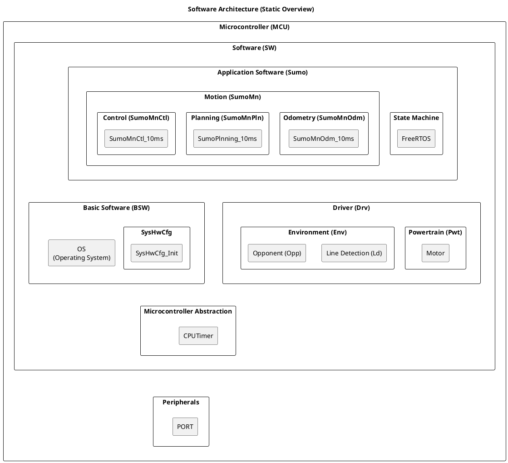

# Sumo Robot Black Magic (Mini)

## SW Architecture

```plantuml
@startuml
title Software Architecture (Static Overview)

skinparam componentStyle rectangle
skinparam packageStyle rectangle
skinparam shadowing false
skinparam defaultTextAlignment center

' === Top-Level Layers ===
rectangle "Microcontroller (MCU)" as MCU {
    rectangle "Software (SW)" as SW {
        package "Application Software (Sumo)" as Sumo {
            component "State Machine" as STM {
                [FreeRTOS] as RTOS
            }

            package "Motion (SumoMn)" as Mn {
                component "Odometry (SumoMnOdm)" as SumoMnOdm {
                    [SumoMnOdm_10ms] as SumoMnOdm_10ms
                }

                component "Planning (SumoMnPln)" as SumoMnPln {
                    [SumoPlnning_10ms] as SumoPlnning_10ms
                }

                component "Control (SumoMnCtl)" as SumoMnCtl {
                    [SumoMnCtl_10ms] as SumoMnCtl_10ms
                }
            }
        }

        package "Basic Software (BSW)" as BSW {
            component "OS\n(Operating System)" as OS {
                [FreeRTOS] as RTOS
            }
            component "SysHwCfg" as SysHwCfg {
                [SysHwCfg_Init] as SysHwCfg_Init
            }
        }

        package "Driver (Drv)" as Drv {
            package "Powertrain (Pwt)" as Pwt {
                component "Motor" as MT {
                
                }
            }

            package "Environment (Env)" as ENV {
                component "Line Detection (Ld)" as LD {
                
                }

                component "Opponent (Opp)" as OPP {
                
                }
            }
        }

        package "Microcontroller Abstraction" as MCAL {
            component "CPUTimer" as CPUTimer
        }
    }

    package "Peripherals" as PER {
        component "PORT" as PORT
    }
}

' === Relationships ===
Sumo -[hidden]-> Drv
Sumo -[hidden]-> BSW
OS -[hidden]-> MCAL
SysHwCfg_Init -[hidden]-> MCAL
Drv -[hidden]-> MCAL
MCAL -[hidden]-> PER : Test

' === Notes ===
'note left of MCAL
'  MCU-specific drivers
'end note

@enduml

```

## Build Commands
- Build SW project
```starlark
bazel build --config=atmega32u4 //machine/evalBoard/sumobotBlackMagic:app
```
