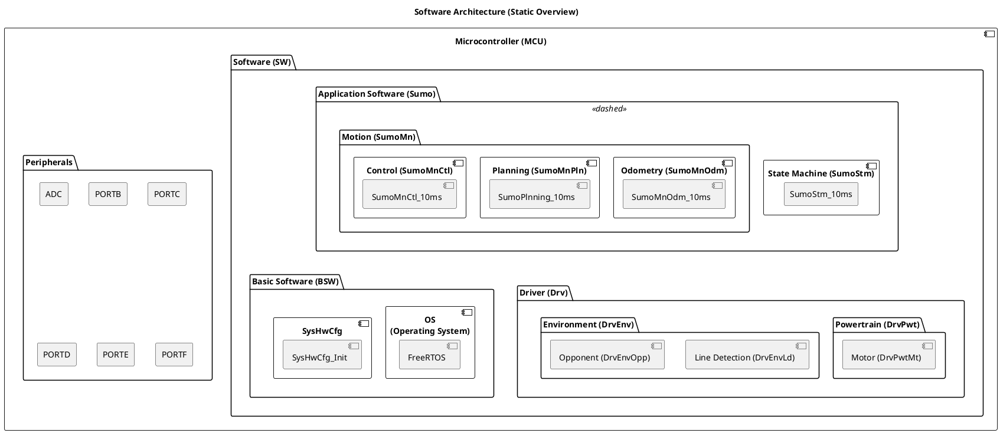

# Sumo Robot Black Magic (Mini)

## Overview
ToDo

## SW Architecture

```plantuml
@startuml
title Software Architecture (Static Overview)

'skinparam componentStyle rectangle
'skinparam packageStyle rectangle
skinparam shadowing false
skinparam defaultTextAlignment center

' === Top-Level Layers ===
component "Microcontroller (MCU)" as MCU {
    package "Software (SW)" as SW {
        package "Application Software (Sumo)" as Sumo <<dashed>> {
            component "State Machine (SumoStm)" as SumoStm {
                rectangle SumoStm_10ms as SumoStm_10ms
            }

            package "Motion (SumoMn)" as Mn {
                component "Odometry (SumoMnOdm)" as SumoMnOdm {
                    [SumoMnOdm_10ms] as SumoMnOdm_10ms
                }

                component "Planning (SumoMnPln)" as SumoMnPln {
                    [SumoPlnning_10ms] as SumoPlnning_10ms
                }

                component "Control (SumoMnCtl)" as SumoMnCtl {
                    [SumoMnCtl_10ms] as SumoMnCtl_10ms
                }
            }
        }

        package "Basic Software (BSW)" as BSW {
            component "OS\n(Operating System)" as OS {
                [FreeRTOS] as RTOS
            }
            component "SysHwCfg" as SysHwCfg {
                [SysHwCfg_Init] as SysHwCfg_Init
            }
        }

        package "Driver (Drv)" as Drv {
            package "Powertrain (DrvPwt)" as DrvPwt {
                component "Motor (DrvPwtMt)" as DrvPwtMt {
                
                }
            }

            package "Environment (DrvEnv)" as DrvEnv {
                component "Line Detection (DrvEnvLd)" as DrvEnvLd {
                
                }

                component "Opponent (DrvEnvOpp)" as DrvEnvOpp {
                
                }
            }
        }
    }

    package "Peripherals" as Per {
        rectangle "ADC" as ADC
        rectangle "PORTB" as PORTB
        rectangle "PORTC" as PORTC
        rectangle "PORTD" as PORTD
        rectangle "PORTE" as PORTE
        rectangle "PORTF" as PORTF
    }

    'portin PB0
    'portin PB1
    'portin PB2
    'portin PB3
    'portin PB4
    'portin PB5
    'portin PB6
    'portin PB7
    'portin PC6
    'portin PC7
    'portin PD0
    'portin PD1
    'portin PD2
    'portin PD3
    'portin PD4
    'portin PD5
    'portin PD6
    'portin PD7
}

' === Relationships ===
Sumo -[hidden]-> Drv
Sumo -[hidden]-> BSW
Per -[hidden]-> Drv
Per -[hidden]-> BSW

'PB0 -up-> PORTB
'PORTB -up-> DrvEnvLd
'DrvEnvLd -up-> SumoMnOdm

' === Notes ===
'note left of MCAL
'  MCU-specific drivers
'end note

@enduml

```

## Build Commands
- Build SW project
```starlark
bazel build --config=atmega32u4 //machine/sumobotBlackMagic:app
```
